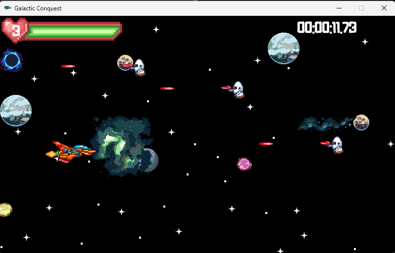

# Galactic Conquest
## Snippets

## Basic Game Overview

This project encompasses a game developed as part of the Game Programming with Data Structures course. The following sections provide insights into various aspects of the game.

## Game Scenes

### Play Scene

Players immerse themselves in an endless survival game, combating enemies to earn stars and achieve high scores.

### Boss Fight

Players can choose a boss to battle from Flash, Vortex, Frostbite, or Crimson. Regardless of the outcome, players earn a guaranteed 100 stars.

### Shop

The shop provides options to purchase skins using stars. Players can navigate between owned and buy menus using numeric keys.

### Help

The help section offers information on game modes, controls, player skins, enemies, and projectiles. Basic controls include Esc for the main menu and M to toggle music.

### Stats

Displays the top 5 high scores achieved by players in Endless Survival mode.

### Credits

A simple page acknowledging the game's creator, development in Monogame, and other relevant details.

### Game Over

Shown when players run out of lives in endless survival mode, offering options to restart the game or return to the main menu. It also displays earned stars and survival time.

### Victory

Displayed after winning a boss fight.

### Defeat

Appears after losing a boss fight.

## Game Mode

### Endless Survival

Survive against alien bots and spaceships, earning stars for every 15 seconds survived. Different enemies spawn, increasing difficulty over time.

### Boss Fight

Four bosses (Flash, Vortex, Frostbite, Crimson) with unique abilities. Players receive 100 stars after completing a boss fight, but skins are disabled.

## Currency and Shop

### Star Currency

Earned by playing endless survival and boss fight modes.

### Skins

Players can buy eight different skins from the shop, each costing 100 stars. Skins can be equipped and used in endless survival mode.

## Player Score Table

Displays the top 5 high scores of players along with the names of equipped skins.

## Music and Sound Effect

Four different music tracks and two sound effects enhance the gaming experience.

## Animations and Transitions

Various animations, including player thrusters and star glowing, along with transitions such as rotating bosses, contribute to the overall gaming atmosphere.

